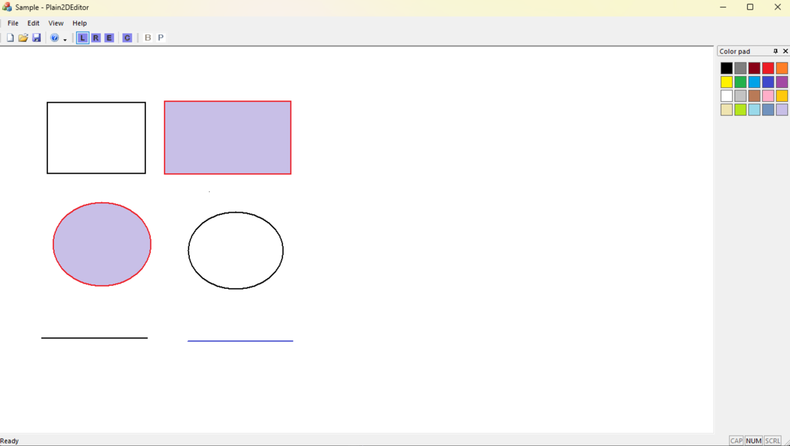
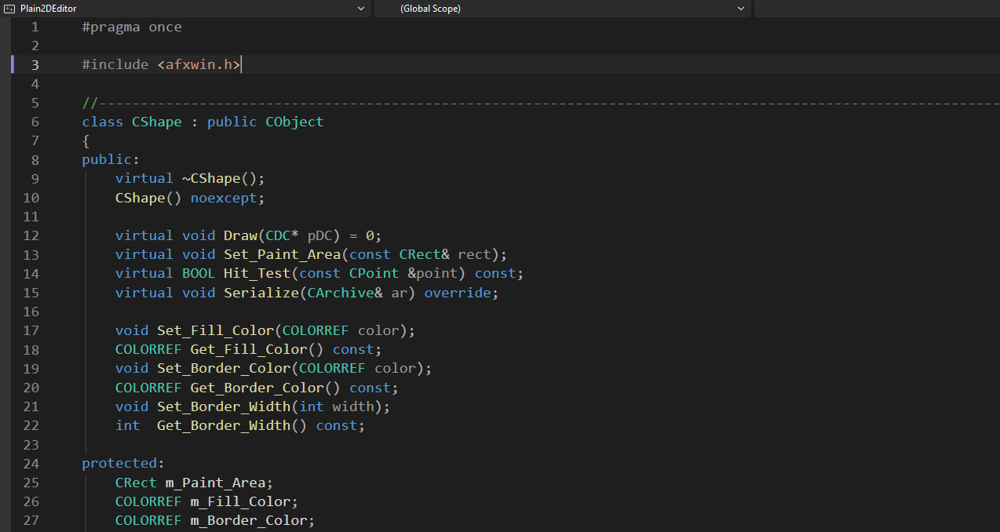
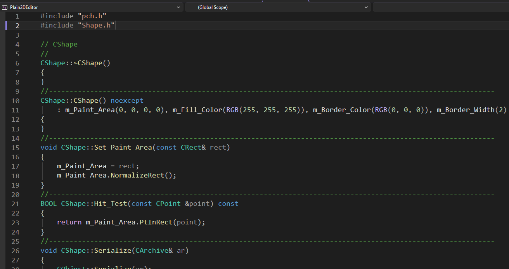
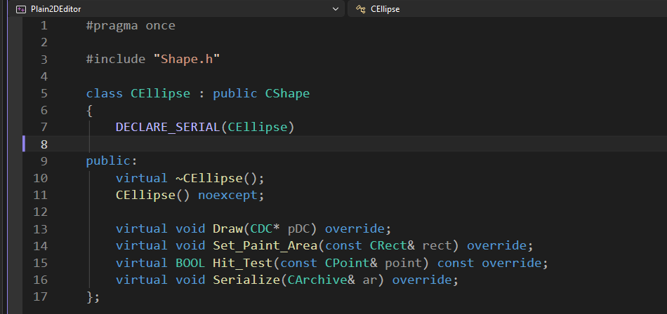
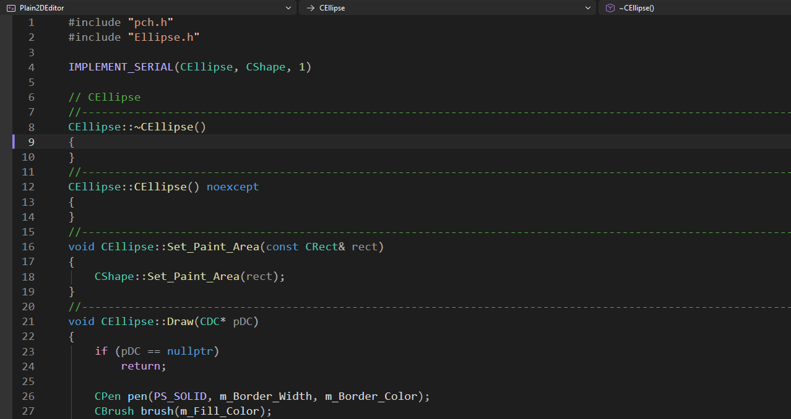

# Plain2DEditor

Простой 2D редактор на основе MFC App.

## Функционал и инструменты

- Панель инструментов для создания трёх типов фигур (линия, элипсис, квадрат)

- Кнопка очистки всех объектов с экрана

- Панель выбора цвета заливки и абриса 
(цвет может применяться как к нарисованным фигурам, так и для предустановки цвета рисования)

- Сериализация

- Возможность отмены отрисовки последней фигуры

## Немного кода из проекта

